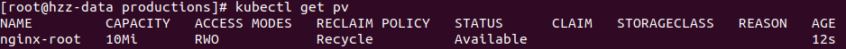
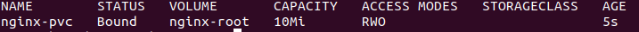
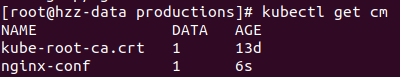

# k8s生产实践:

目标: 布署一个生产环境的web服务用于查询

布署两台 nginx, 模拟一个集群的测试环境
使用pv共享存储, 放置一些 html 文件, 并且配置一个反向代理, 动态请求当前的时间

布署 mysql 两台, 做一个主从热备, 采用statefulset模式, 模拟多个请求

导出一个service, 做为一个对外接口
采用 ingress 做负载均衡

## 创建 NFS 存储
具体方法: https://blog.csdn.net/wudinaniya/article/details/81068518
创建位置: 10.240.53.33  /opt/nfs_shared

## 创建 nginx 的 root 存储 PersistentVolume
__注意__: 因为我们是要创建一个nginx集群,并使用负载均衡,所以我们将home地址, 设为一个NFS的地址, 这样三台nginx可以使用一份home代码

```
apiVersion: v1
kind: PersistentVolume
metadata:
  name: nginx-root
  labels:
    pv: nginx-root
spec:
  capacity:
    storage: 10Mi
  volumeMode: Filesystem
  accessModes:
    - ReadWriteOnce
  persistentVolumeReclaimPolicy: Recycle
  nfs:
    path: /opt/nfs_shared
    server: 10.240.53.33
```
运行:
> kubectl apply - nginx_root.yaml



创建卷和server的绑定 PersistentVolumeClaim
```
apiVersion: v1
kind: PersistentVolumeClaim
metadata:
  name: nginx-pvc
spec:
  accessModes:
    - ReadWriteOnce
  resources:
    requests:
      storage: 10Mi
```


从截图可以看到, nginx-pvc 自动选择了刚才声明的nginx-root, 但是在生产环境中, 可能会有多个卷, 所以我们在创建的时候, 会在PV上增加 label, 然后在 pvc 时, 可以用label 进行过滤
```
apiVersion: v1
kind: PersistentVolume
metadata:
  name: nginx-root
  labels:
    pv: nginx-root
spec:
  capacity:
    storage: 10Mi
  volumeMode: Filesystem
  accessModes:
    - ReadWriteOnce
  persistentVolumeReclaimPolicy: Recycle
  hostPath:
    path: /opt/k8s/nginx_home
```
对应的pvc, 则修改为:
```
apiVersion: v1
kind: PersistentVolumeClaim
metadata:
  name: nginx-pvc
spec:
  accessModes:
    - ReadWriteOnce
  resources:
    requests:
      storage: 10Mi
  selector:
    matchLabels:
      pv: nginx-root    
```
这样, 如里有多个PV时, 也可以根据此来准确匹配
参考地址:
    https://blog.csdn.net/andya_net/article/details/104730148
    https://blog.csdn.net/michaelwubo/article/details/80759605
    https://www.jianshu.com/p/99e610067bc8
    https://zhuanlan.zhihu.com/p/262468357
    http://docs.kubernetes.org.cn/429.html#glusterfs
    https://kubernetes.io/zh/docs/concepts/storage/persistent-volumes/

## 创建ConfigMap, 用于存储nginx 的conf配置
创建 nginx.conf
```
server {
    root /usr/local/antiy;
    listen 80;
}
```
生成 ConfigMap:
> kubectl create configmap nginx-conf --from-file=./nginx.conf

查看生成的结果:



## 创建 nginx 
```
apiVersion: v1
kind: Deployment
metadata:
  name: nginx-antiy
spec:
  replicas: 3
  template:
    metadata:
      labels:
        app: nginx
    spec:
      containers:
      - name: nginx-antiy
        image: nginx
        port:
        - containerPort: 80
        volumeMounts:
        - name: nginx-conf
          mountPath: /etc/nginx/conf.d/
          readOnly: true
        - name: nginx-root
          mountPath: /usr/local/antiy
  volumes:
  - name: nginx-conf
    configMap:
      name: nginx-conf
  - name: nginx-root
    persistentVolumeClaim:
      name: nginx-pvc
```

## 创建service
```
apiVersion: v1
kind: Service
metadata:
  name: nginx-service
  labels:
    app: nginx
spec:
  type: NodePort
  ports:
  - port: 80
    targetPort: 80
    nodePort: 30999
  selector:
    app: nginx
```
__注意__
+ port: 80  # port是k8s集群内部访问service的端口，即通过clusterIP: port可以访问到某个service
+ targetPort: 80  #targetPort是pod的端口，从port和nodePort来的流量经过kube-proxy流入到后端pod的targetPort上，最后进入容器
+ nodePort: 32500  #nodePort是外部访问k8s集群中service的端口，通过nodeIP: nodePort可以从外部访问到某个service


## 采用Ingress模式, 创建负载均衡
https://segmentfault.com/a/1190000019908991
可以参考这个, 由于用来测试, 暂时不研究这个了
```
apiVersion: apps/v1
kind: Ingree
metadata:
  name: nginx-ingress
  annotations:
    kubernetes.io/ingress.class: "nginx"
    nginx.ingress.kubernetes.io/use-regex: "true"
spec:
  rules:
  - http:
      paths:
      - backend:
          serviceName: nginx-service
          servicePort: 80
```
# 以Stateful模式布署mysql
目标: 布署两台 mysql 服务器, 并设置主从备份

首先创建持久存储, 在statefulset模式下, 可以设置StorageClass 动态分配, 但是NFS和本地卷模式不支持,所以静态创建两个卷
```
apiVersion: v1
kind: PersistentVolume
metadata:
  name: mysql-data0
  labels:
    app: mysql-data
spec:
  capacity:
    storage: 1Gi
  volumeMode: Filesystem
  accessModes:
    - ReadWriteOnce
  persistentVolumeReclaimPolicy: Retain
  storageClassName: mysql-pv
  nfs:
    path: /opt/nfs_mysql
    server: 10.240.53.33
```

创建secret, 用于保存mysql的密码: [更多详情](https://kubernetes.io/zh/docs/concepts/configuration/secret/)
```
apiVersion: v1
kind: Secret
metadata:
  name: mysql-password
type: Opaque
data:
  mysql-root-password: cm9vdA==
  mysql-password: dGVzdA==
```

创建服务, 包括headless, service
```
apiVersion: v1
kind: Service
metadata:
  name: mysql-service
  labels:
    app: mysql
spec:
  ports:
  - name: mysql
    port: 3306
  clusterIP: None
  selector:
    app: mysql
---
apiVersion: v1
kind: Service
metadata:
  name: mysql-read
  labels:
    app: mysql
spec:
  ports:
  - name: mysql
    port: 3306
  selector:
    app: mysql
```

创建statefulset, 以下模式为了创建主从同步, 采用的是xtrabackup用来拷贝主库的数据至从库
mysql-stateful.yaml
```
apiVersion: v1
kind: StatefulSet
metadata:
  name: mysql
  labels:
    app: mysql
spec:
  selector:
    matchLabels:
      app: mysql
  serverName: mysql-service
  replicas: 3
  template:
    metadata:
      labels:
        app: mysql
    spec:
      initContainers:
      - name: init-mysql
        image: mysql:5.7
        command:
        - bash
        - "-c"
        - |
          set -ex
          [[ `hostname` =~ -([0-9]+)$ ]] || exit 1
          ordinal=${BASH_REMATCH[1]}
          echo [mysqld] > /mnt/conf.d/server-id.cnf
          echo server-id=$((100 + $ordinal)) >> /mnt/conf.d/server-id.cnf
          if [[ $ordinal -eq 0 ]]; then
            cp /mnt/config-map/primary.cnf /mnt/conf.d/
          else
            cp /mnt/config-map/replica.cnf /mnt/conf.d/
          fi
        volumeMount:
        - name: conf
          mountPath: /mnt/conf.d
        - name: config-map
          mountPath: /mnt/config-map
      - name: clone-mysql
        image: gcr.io/google-samples/xtrabackup:1.0
        command:
        - bash
        - "-c"
        - |
          set -ex
          [[ -d /var/lib/mysql/mysql ]] && exit 0
          [[ `hostname` =~ -([0-9]+)$ ]] || exit 1
          ordinal=${BASH_REMATCH[1]}
          [[ $ordinal -eq 0 ]] && exit 0
          ncat --recv-only mysql-$(($ordinal-1)).mysql 3307 | xbstream -x -C /var/lib/mysql
          xtrabackup --prepare --target-dir=/var/lib/mysql
        volumeMount:
        - name: data
          mountPath: /var/lib/mysql
        - name: conf
          mountPath: /etc/mysql/conf.d
      containers:
      - name: mysql
        image: mysql:5.7
        ports:
        - name: mysql
          containerPort: 3306
        volumeMount:
        - name: data
          mountPath: /var/lib/mysql
          subPath: mysql
        - name: conf
          mountPath: /etc/mysql/conf.d
      - name: xtrabackup
        image: gcr.io/google-samples/xtrabackup:1.0
        ports:
        - name: xtrabackup
          containerPort: 3307
        command:
        - bash
        - "-c"
        - |
          set -ex
          cd /var/lib/mysql
          if [[ -f xtrabackup_slave_info && "x$(<xtrabackup_slave_info)" != "x" ]]; then
            cat xtrabackup_slave_info | sed -E 's/;$//g' > change_master_to.sql.in
            rm -f xtrabackup_slave_info xtrabackup_binlog_info
          elif [[ -f xtrabackup_binlog_info ]]; then
            [[ `cat xtrabackup_binlog_info` =~ ^(.*?)[[:space:]]+(.*?)$ ]] || exit 1
            rm -f xtrabackup_binlog_info xtrabackup_slave_info
            echo "CHANGE MASTER TO MASTER_LOG_FILE='${BASH_REMATCH[1]}',\
                  MASTER_LOG_POS=${BASH_REMATCH[2]}" > change_master_to.sql.in
          fi
          if [[ -f change_master_to.sql.in ]]; then
            echo "Waiting for mysqld to be ready (accepting connections)"
            until mysql -h 127.0.0.1 -e "SELECT 1"; do sleep 1; done

            echo "Initializing replication from clone position"
            mysql -h 127.0.0.1 \
                  -e "$(<change_master_to.sql.in), \
                          MASTER_HOST='mysql-0.mysql', \
                          MASTER_USER='root', \
                          MASTER_PASSWORD='', \
                          MASTER_CONNECT_RETRY=10; \
                        START SLAVE;" || exit 1
            mv change_master_to.sql.in change_master_to.sql.orig
          fi
          exec ncat --listen --keep-open --send-only --max-conns=1 3307 -c \
            "xtrabackup --backup --slave-info --stream=xbstream --host=127.0.0.1 --user=root"
        volumeMount:
        - name: data
          mountPath: /var/lib/mysql
          subPath: mysql
        - name: conf
          mountPath: /etc/mysql/conf.d
      volumes:
      - name: conf
        emptyDir: {}
      - name: config-map
        configMap:
          name: mysql-conf
  volumeClaimTemplates:
  - metadata:
      name: data
    spec:
      accessModes:['ReadWriteOnly']
      storageClassName: mysql-pv
      resources:
        requests:
          storage: 5Gi 
```

在此做了下手动处理, 去掉xtrabackup模式, 手动增加从库的设置
```
apiVersion: apps/v1
kind: StatefulSet
metadata:
  name: mysql
  labels:
    app: mysql
spec:
  selector:
    matchLabels:
      app: mysql
  serviceName: mysql-service
  replicas: 2
  template:
    metadata:
      labels:
        app: mysql
    spec:
      initContainers:
      - name: init-mysql
        image: mysql:5.7
        command:
        - bash
        - "-c"
        - |
          set -ex
          [[ `hostname` =~ -([0-9]+)$ ]] || exit 1
          ordinal=${BASH_REMATCH[1]}
          echo [mysqld] > /mnt/conf.d/server-id.cnf
          echo server-id=$((100 + $ordinal)) >> /mnt/conf.d/server-id.cnf
          if [[ $ordinal -eq 0 ]]; then
            cp /mnt/config-map/primary.cnf /mnt/conf.d/
          else
            cp /mnt/config-map/replica.cnf /mnt/conf.d/
          fi
        volumeMounts:
        - name: conf
          mountPath: /mnt/conf.d
        - name: config-map
          mountPath: /mnt/config-map
        env:
        - name: MYSQL_ROOT_PASSWORD
          valueFrom:
            secretKeyRef:
              key: mysql-root-password
              name: mysql-password
        - name: MYSQL_PASSWORD
          valueFrom:
            secretKeyRef:
              key: mysql-password
              name: mysql-password
        - name: MYSQL_USER
          value: test
      containers:
      - name: mysql
        image: mysql:5.7
        ports:
        - name: mysql
          containerPort: 3306
        volumeMounts:
        - name: data
          mountPath: /var/lib/mysql
          subPath: mysql
        - name: conf
          mountPath: /etc/mysql/conf.d
        env:
        - name: MYSQL_ROOT_PASSWORD
          valueFrom:
            secretKeyRef:
              key: mysql-root-password
              name: mysql-password
        - name: MYSQL_PASSWORD
          valueFrom:
            secretKeyRef:
              key: mysql-password
              name: mysql-password
        - name: MYSQL_USER
          value: test
      volumes:
      - name: conf
        emptyDir: {}
      - name: config-map
        configMap:
          name: mysql-conf
  volumeClaimTemplates:
  - metadata:
      name: data
    spec:
      accessModes: ['ReadWriteOnce']
      storageClassName: mysql-pv
      resources:
        requests:
          storage: 1Gi
```
# 扩展开发: 扩展Kubernetes API
## 创建和部署自定义资源定义
查看api版本
> kubectl api-versions
```
apiVersion: apiextensions.k8s.io/v1
kind: CustomResourceDefinition
metadata:
    name: antiy.cn
spec:
    group: k8s.packt.com
    names:
        kind: WeatherReport
        listKind: WeatherReportList
        plural: weatherreports
        singular: weatherreport
scope: Namespaced
version: v1

```

# sidecar 模式实践
前置条件:
+ MutatingAdmissionWebhook 要求 Kubernetes 版本为 1.9.0 及以上
+ 其 admissionregistration.k8s.io/v1beta1 API 可用。确保下面的命令：
> kubectl api-versions | grep admissionregistration.k8s.io/v1beta1

## 生成工程目录 antiysec
> mkdir antiysec

建立go mod
> go mod init antiy.cn/v2

初始化框架:
> kubebuilder init --domain antiy.cn --owner antiy --skip-go-version-check

__注意__: 因为我的golang 版本是源码编译的, 所以需要增加 --skip-go-version-check 参数

自定义一个resource:
> kubebuilder create api --group sec --version v1beta1 --kind Antiysec

创建webhook
> kubebuilder create webhook --group sec --version v1beta1 --kind Antiysec --programmatic-validation
可以看到，api/v1beta1/下多了一个unit_webhook.go文件，里面有4个方法以及列出来了
+ Default() 用于修改，即对应mutating webhook
+ ValidateCreate()用于校验，对应validating webhook，仅在create操作使用
+ ValidateUpdate()用于校验，对应validating webhook，仅在update操作使用
+ ValidateDelete()用于校验，对应validating webhook，仅在delete操作使用

以Default()和ValidateCreate()为例，来实现简单的Unit实例持久化之前的修改Unit默认字段、内容校验的逻辑
```
```


编译:
> make 

常见问题:
https://blog.csdn.net/ANXIN997483092/article/details/104233494


__注意__ group / version / kind 这三个属性组合起来来标识一个 K8S 的 CRD。
kind 要首字母大写而且不能有特殊符号。
在创建过程中，我们可以选择让 KubeBuilder 来是否生成 Resource / Controller 等

生成自定义资源:
> bin/kustomize build config/crd

将生成的 yaml 格式的文件, 导入进k8s, 运行命令:
> kubectl get crd

```
antiysecs.sec.antiy.cn                      2021-01-28T09:06:31Z
```

修改 Reconcile 函数
```
func (r *AntiysecReconciler) Reconcile(ctx context.Context, req ctrl.Request) (ctrl.Result, error) {
	_ = r.Log.WithValues("antiysec", req.NamespacedName)

	obj := &secv1beta1.Antiysec{}
	if err := r.Get(ctx, req.NamespacedName, obj); err != nil {
		log.Println(err, "unable to fetch object")
	} else {
		log.Println("Getting from kuberbuilder to", obj.Spec.Foo)
	}

	obj.Status.Result = "running"
	if err := r.Status().Update(ctx, obj); err != nil {
		log.Println(err, "unable to update status")
	}
	return ctrl.Result{}, nil
}
```
重新编译, 会生成 bin/manager

制作镜像:
```
FROM alpine:3.4
MAINTAINER antiy

WORKDIR /
COPY bin/manager manager

ENTRYPOINT ["/manager"]
```

生成镜像:
> docker build -t antiysec -f docker/Dockerfile  .

生成tag:
> docker tag antiysec:latest 10.240.53.31:30800/antiy-cloud/antiysec:1.0

上传至harbor:
> docker push 10.240.53.31:30800/antiy-cloud/antiysec:1.0

