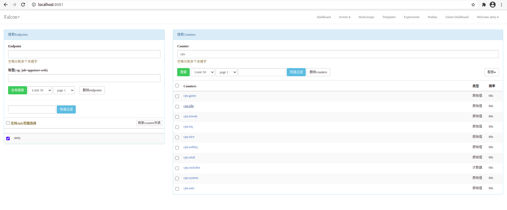
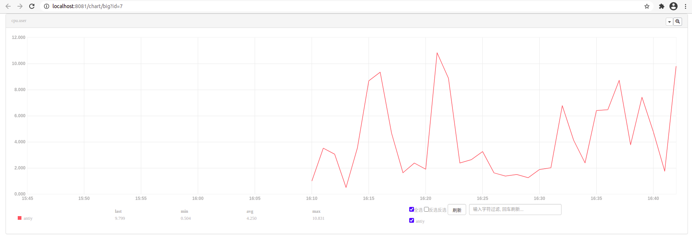
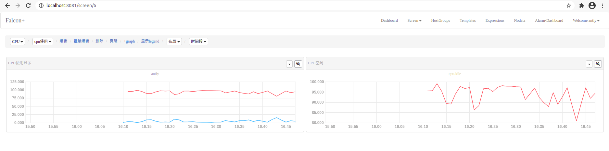
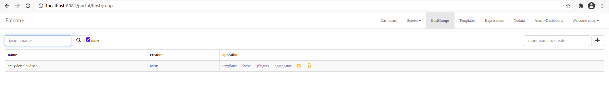
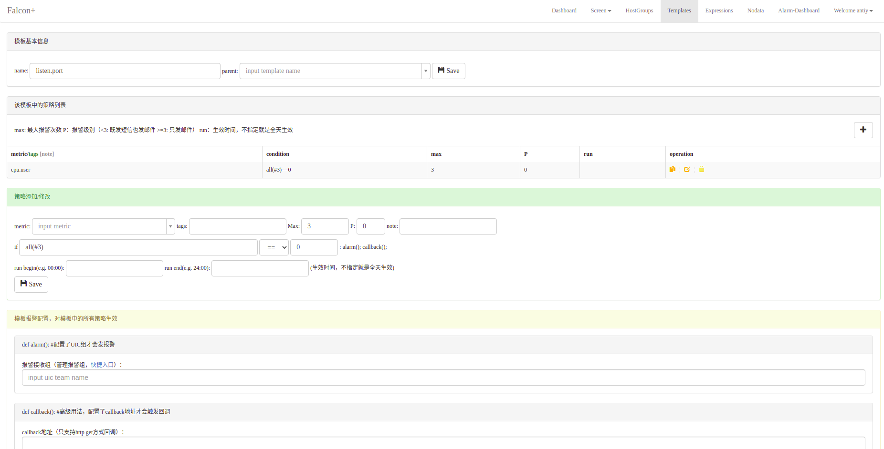
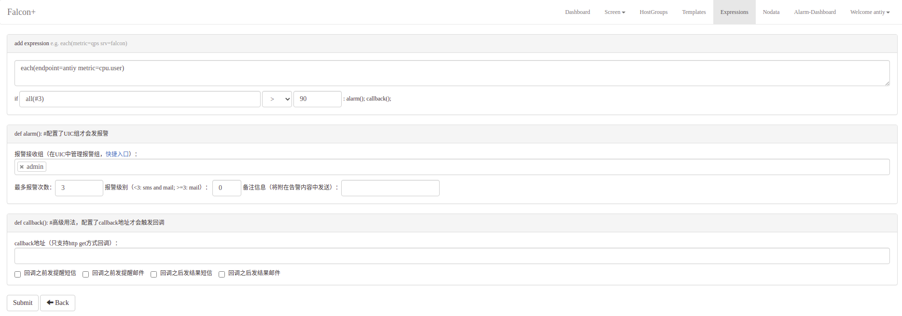
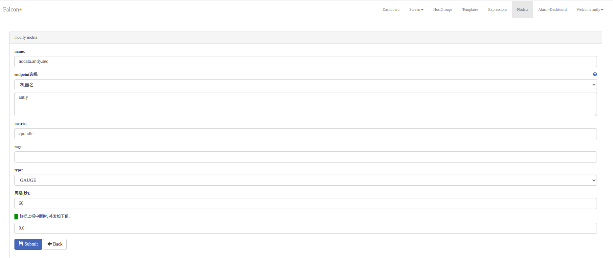
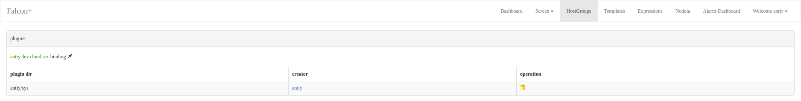
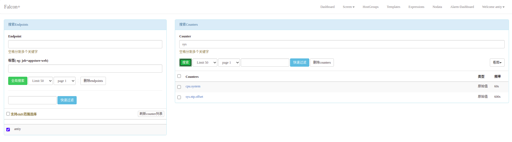

# open-falcon
社区文档(https://book.open-falcon.org/zh_0_2/usage/)

# open-falcon布署

* 安装mysql, redis 并且运行良好
* 下载静态安装包, 解压
* 按照序号导入SQL文件
* 修改相应模块 config/cfg.json, 按mysql的用户名和密码修改
* 运行 open-falcon start, 启动服务, 如果启动失败, 则查看对应模块的 logs 日志
* 布署 dashboard, 此模块是用flask写的, 所以需要布署 python2 虚拟环境
* 需要安装相应的pip文件, 
* 如果缺少依赖, 应该是需要安装以下:
```
sudo apt-get install libldap2-dev
sudo apt-get install libsasl2-dev
```
启动后, 需要修改请求的端口, dashboard请求的是 18080, api监听的是 8080, 此处需要修改下, 保持一致即可
rrd/config.py, 此文件修改dashboard访问数据库的配置

# open-falcon 操作
## 用户登录后, 进入主页

左边为endpoints列表, 从下可以看到布署的主机 (antiy)
右边为counter列表, 显示的是关注的metric, 点击其中一项, 可以查看图形


## Screen页面
此处可以自由定义要监测的数据列表, 可自定义添加, 此处我添加了一个cpu.user事件


## HostGroup
此处定义主机的组, 可以将主机分组, 组起名规则:
> sa.dev.falcon.judge，这个名称有讲究，sa是我们部门，dev是我们组，falcon是项目名，judge是组件名
创建完毕, 点击hosts, 将主机 antiy 添加至组内, 在此条内, 同时也可以配置模板, 聚合



## Templates
在这里设置模板的信息, 可以输入模板名, 也可以指定模板的父模板, 以及通知的组等, 模板可以和主机组进行绑定


## Expression
在这里配置策略


## nodata


## Alarm-dashboard
在此处显示报警列表

## 插件plugin
修改配置文件 agent/config/cfg.json, 将插件的开关置为 enable
手动在 plugin 目录下创建python文件, 10_test.py, 注意命名格式, 前面的数字为间隔
```
#!/usr/bin/python
# coding: utf-8

import os
import json
import time

data = [{"endpoint": "antiy", "tags": "", "timestamp": int(time.time()), "metric": "sys.ntp.offset", "value": 0.73699999999999999, "counterType": "GAUGE", "step": 600}]
print(json.dumps(data))
```
在控制台HostGroup指定plugin


将此插件放入相应的目录, 如:
antiy/sys, 则目录为 plugin/antiy/sys/10_test.py

然后插件开始运行, 10秒后, 在counter中可以看到此信息已上报



# open-falcon 分析

```
metric: 最核心的字段，监控指标名称，代表这个采集项具体度量的是什么, 比如是cpu_idle呢，还是memory_free, 还是qps
endpoint: 标明Metric的主体(属主)，比如metric是cpu_idle，那么Endpoint就表示这是哪台机器的cpu_idle，一般使用机器的 hostname
timestamp: 表示上报该数据时的unix时间戳，注意是整数，代表的是秒
value: 代表该metric在当前时间点的值，float64
step: 表示该数据采集项的上报周期，这对于后续的配置监控策略很重要，必须明确指定。
counterType: 是Open Falcon定义的数据类型，取值只能是COUNTER或者GAUGE二选一，前者表示该数据采集项为计时器类型，后者表示其为原值 (注意大小写)
  - GAUGE：即用户上传什么样的值，就原封不动的存储
  - COUNTER：指标在存储和展现的时候，会被计算为speed，即（当前值 - 上次值）/ 时间间隔
tags: 监控数据的属性标签，一组逗号分割的键值对, 对metric进一步描述和细化, 可以是空字符串. 比如idc=lg，比如service=xbox等，多个tag之间用逗号分割
```

## 报警函数说明
```
all(#3): 最新的3个点都满足阈值条件则报警
max(#3): 对于最新的3个点，其最大值满足阈值条件则报警
min(#3): 对于最新的3个点，其最小值满足阈值条件则报警
sum(#3): 对于最新的3个点，其和满足阈值条件则报警
avg(#3): 对于最新的3个点，其平均值满足阈值条件则报警
diff(#3): 拿最新push上来的点（被减数），与历史最新的3个点（3个减数）相减，得到3个差，只要有一个差满足阈值条件则报警
pdiff(#3): 拿最新push上来的点，与历史最新的3个点相减，得到3个差，再将3个差值分别除以减数，得到3个商值，只要有一个商值满足阈值则报警
lookup(#2,3): 最新的3个点中有2个满足条件则报警
```
最常用的就是all函数了，比如cpu.idle all(#3) < 5，表示cpu.idle的值连续3次小于5%则报警。
